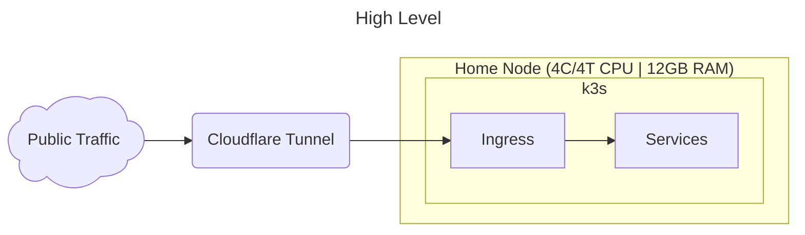
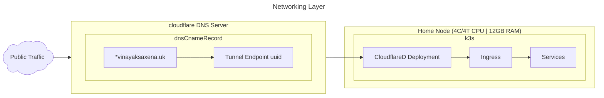

# Home lab infra

<!--  -->

```mermaid
---
title: High Level
---
%% LR means left to right, TD means top-down


flowchart LR
    cloud@{ shape: cloud, label: "Public Traffic" } --> id2("Cloudflare Tunnel") --> id3
subgraph comp["Home Node (4C/4T CPU | 12GB RAM)"]
    k3s
end

subgraph "k3s"
    direction LR
    id3["Ingress"] --> id4["Services"]
end
```

```mermaid
---
title: Networking Layer
---


flowchart LR
    publicTrafficCloud@{ shape: cloud, label: "Public Traffic" } --> id9
    id9 --> cloudflareD
    
    
subgraph myNode["Home Node (4C/4T CPU | 12GB RAM)"]
    k3s
end

subgraph "k3s"
    direction LR
    cloudflareD["CloudflareD Deployment"]
    cloudflareD --> id3["NGINX Ingress"]
    id3["Ingress"] --> id4["Services"]
end


subgraph id9["cloudflare DNS Server"]
    direction LR
    dnsCnameRecord
end

subgraph "dnsCnameRecord"
    direction LR
    id5["*vinayaksaxena.uk"]--> id6["Tunnel Endpoint uuid"]
end

```