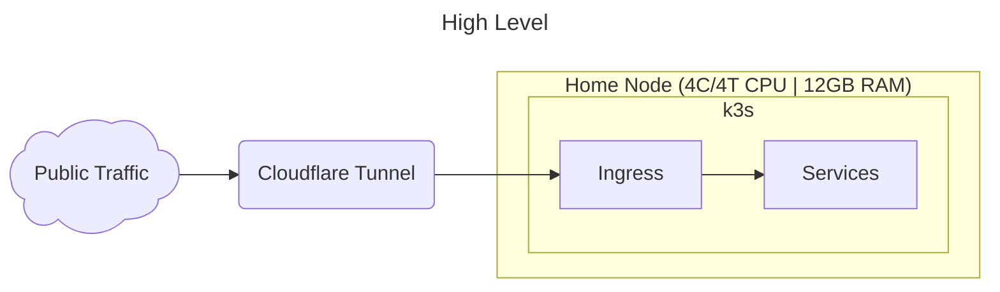
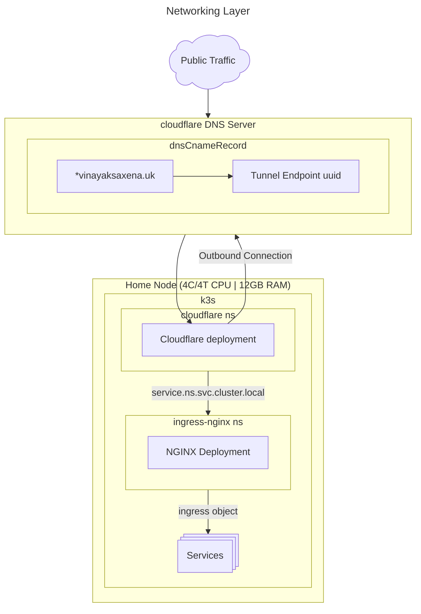
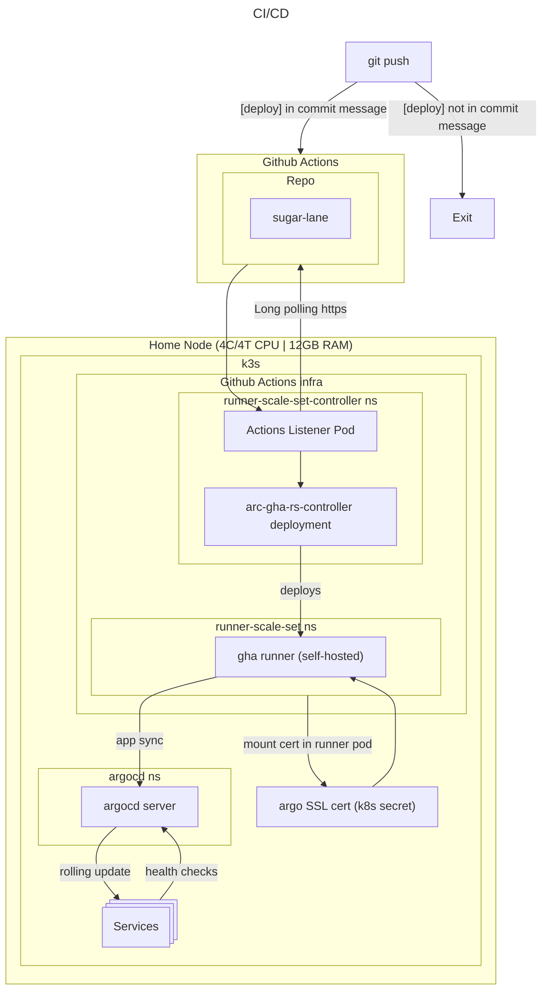

# Home lab infra

<!--  -->

```mermaid
---
title: High Level
---
%% LR means left to right, TD means top-down


flowchart LR
    cloud@{ shape: cloud, label: "Public Traffic" } --> id2("Cloudflare Tunnel") --> id3
subgraph comp["Home Node (4C/4T CPU | 12GB RAM)"]
    k3s
end

subgraph "k3s"
    direction LR
    id3["Ingress"] --> id4["Services"]
end
```

```mermaid
---
title: Networking Layer
---


flowchart TD
    publicTrafficCloud@{ shape: cloud, label: "Public Traffic" } --> cloudFlareServer
    cloudflaredpod --Outbound Connection--> cloudFlareServer
    cloudFlareServer --> cloudflaredpod
    
    
    
subgraph myNode["Home Node (4C/4T CPU | 12GB RAM)"]
    k3s
end

subgraph "k3s"
    direction LR
    
    services@{ shape: processes, label: "Services" }

    
    cloudflarens --service.ns.svc.cluster.local--> nginxns
    nginxns --ingress object--> services


end


subgraph cloudFlareServer["cloudflare DNS Server"]
    direction LR
    dnsCnameRecord
end

subgraph "dnsCnameRecord"
    direction LR
    CNAMEKey["*vinayaksaxena.uk"]
    CNAMEValue["Tunnel Endpoint uuid"]
    CNAMEKey --> CNAMEValue
end

subgraph cloudflarens["cloudflare ns"]
    cloudflaredpod["Cloudflare deployment"]

end

subgraph nginxns["ingress-nginx ns"]
    ingresspod["NGINX Deployment"]
end
```

```mermaid
---
title: CI/CD
---


flowchart TD
    trigger["git push"]
    doNothing["Exit"]
    subgraph githubServer["Github Actions"]
        subgraph "Repo"
            repo["sugar-lane"]
        end
    end
    subgraph myNode["Home Node (4C/4T CPU | 12GB RAM)"]
        subgraph k3s
            subgraph ghasetup["Github Actions infra"]
                subgraph arccontrollerns["runner-scale-set-controller ns"]
                    ghacontrollerpod["arc-gha-rs-controller deployment"]
                    listenerpod["Actions Listener Pod"]
                    listenerpod --> ghacontrollerpod
                end
                subgraph selfhostedrunnerns["runner-scale-set ns"]
                    selfhostedpods["gha runner (self-hosted)"]
                end
            end

            subgraph argocdns["argocd ns"]
                argocdserverpod["argocd server"]

            end
            argocdcert["argo SSL cert (k8s secret)"]
            services@{ shape: processes, label: "Services" }

            selfhostedrunnerns --mount cert in runner pod--> argocdcert
            argocdcert --> selfhostedpods

            selfhostedpods --"app sync"--> argocdserverpod
            ghacontrollerpod --deploys--> selfhostedpods
            argocdserverpod --"rolling update"--> services
            services --"health checks"-->argocdserverpod
            
        end   
    end
listenerpod --Long polling https--> Repo
Repo --> listenerpod
trigger --"[deploy] in commit message"--> githubServer
trigger --"[deploy] not in commit message"-->doNothing
    

```