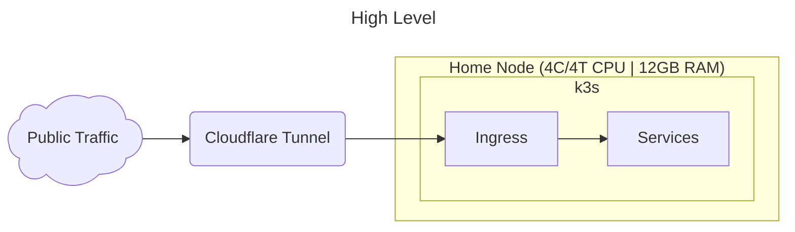
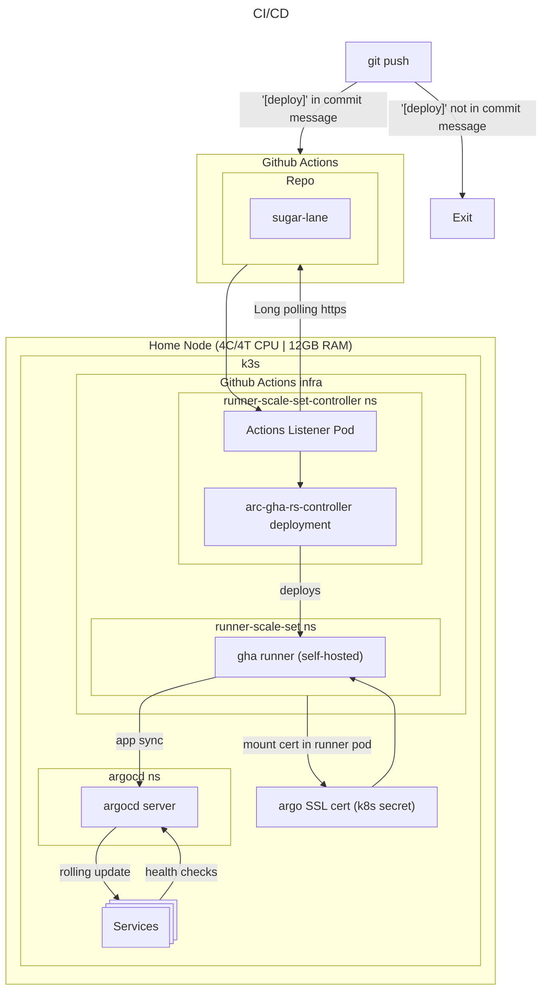

## Home lab infra

#### High Level Architecture
Currently this is a single node homelab running on bare-metal, hosting 8 QoL services across a k3s cluster. All workloads are containerized, using the official helm charts, managed declaratively via argoCD. The node is LAN only, select services (Tracker, Immich) are exposed externally via Cloudflare Tunnel without exposing the home IP.
<!--  -->

#### Networking Layer
I am using cloudflare tunnel to expose my services (tracker, immich) for bot protection, preventing scraping, DDOS, and to keep home IP protected. 
- Cloudflare has a DNS record of my domain `vinayaksaxena.uk` (managed via terraform), mapping to my tunnel endpoint
- My cloudflared deployment (deployed on the cluster) maintains a persistent outbound connection to cloudflare servers
- Any traffic which hits the domain will be resolved to my tunnel endpoint, and traffic will be proxied through to the ingress manager
- K3s ships with Traefik, but I have over-written this with NGINX to maintain industry standards (however as of [March 2026](https://kubernetes.io/blog/2025/11/11/ingress-nginx-retirement/) NGINX ingress will not be maintained, I eventually plan to replace with gateway API )
- Traffic proxied through to NGINX is accordinly sent to whichever service based on my ingress objects

#### Deployments
- Using github actions for the orchestration layer, as it integrates nicely with my development workflow in `git push`. Additionally, github actions offers self hosted runners, so I can run deployments/migrations without having to expose any traffic, as it all runs internally on the cluster
- Deployments are only made when "[deploy]" is part of the message of the commit
- Github actions runners are self hosted within the cluster, there are 2 components
    - **Runner Controller Set** this is a k8s operator that scales and deploys runners based on the job queue
    - **Runner Scale Set** this deployment deploys a listener pod, which polls github for any pending jobs -- if found, it will tell k8s to spin up a runner to run the workflow in
    - The runner and the controller are defined in separate namespaces to maintain security and least privelage
- To allow the runners to make secure requests to argo, they need an SSL certificate -- the argocd cert has been mounted on the runners at `/etc/argocd-cert/argo-cert.crt` allowing us to interact with the api

